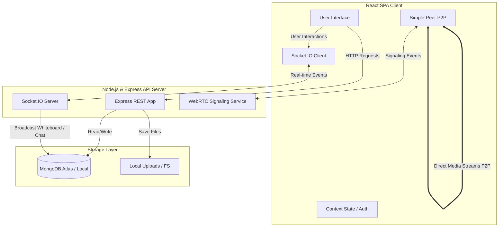

# 🖥️ ConnectedDesk

ConnectedDesk is a full-stack, real-time collaboration hub designed specifically for small teams, student groups, and agile project workflows. It integrates core teamwork surfaces—ranging from project management and documentation to real-time chat, video calling, and interactive whiteboards—into a single, unified workspace.

---

### 🛡️ Tech Stack & Badges


---

## ✨ Features Overview

ConnectedDesk is structured to cover the complete team workflow:

*   **📊 Interactive Dashboard**: A central workspace overview. Powered by **Recharts**, it aggregates project-wide tasks, upcoming events, unread notifications, and user activity logs into interactive graphs.
*   **📋 Kanban Task Board**: Fully functional project management using **@hello-pangea/dnd** for drag-and-drop workflow updates. Supports subtasks, descriptions, assignees, and comments.
*   **💬 Real-Time Chat Rooms**: Channel-based chat built on **Socket.IO** with status updates (typing indicators) and offline history retrieval.
*   **📹 Peer-to-Peer Video/Voice Calls**: Seamless team meetings directly in the app. Integrates **Simple-Peer** (WebRTC) signaled through Socket.IO for direct audio-video streams with zero server lag.
*   **🎨 Shared Collaborative Whiteboard**: Multiple team members can sketch out ideas on a synchronized canvas. Real-time draw strokes are broadcast via WebSockets.
*   **📅 Event Calendar**: Schedule meetings, define attendees, track events, and receive push notifications on the dashboard.
*   **📁 Resources Cabinet**: Shared file uploads and downloads. Supported by **Multer** on the server for secure processing of team attachments.
*   **🤖 AI Assistant Companion**: A contextual overlay that helps team members draft task details, summarize conversations, or retrieve key project information.
*   **⌨️ Universal Command Palette**: Press `Ctrl+K` (or `Cmd+K`) from anywhere in the client to open search navigation and run app commands instantly.
*   **🧘 focus Mode**: Built-in Pomodoro timers and high-quality ambient background sounds (Lofi, rain, white noise) to help engineers stay focused.

---

## 🏗️ Architecture & Communication Flow

ConnectedDesk uses a hybrid API structure. Standard database updates run via a REST API, while state changes that require immediate collaboration (chat, whiteboards) run over WebSockets. Media streams are established Peer-to-Peer (P2P).



---

## 📂 Project Structure

```text
ConnectedDesk/
├── client/                 # React Frontend Application (Vite Build)
│   ├── public/             # Static assets (favicons, manifest)
│   └── src/
│       ├── assets/         # App-specific logos, sound bytes (Focus Mode)
│       ├── components/     # Reusable blocks (AI Assistant, Command Palette, etc.)
│       ├── context/        # React Context stores (AuthContext, ThemeContext)
│       ├── pages/          # Complete page views (Dashboard, Tasks, Chat, Whiteboard)
│       ├── styles/         # Custom CSS stylesheets
│       ├── tests/          # Component/Unit tests using Vitest
│       └── utils/          # API helper configurations & formatting scripts
├── server/                 # Express API & WebSocket Server
│   ├── controllers/        # Request handlers (Auth, Tasks, Chat, Meetings)
│   ├── middleware/         # Auth checkers, Multer config, and error handlers
│   ├── models/             # Mongoose Schemas (User, Task, Meeting, Message)
│   ├── routes/             # REST route mapping (Express Router)
│   └── uploads/            # Server-side repository for file attachments
└── scripts/                # Automated validation and syntax-checking workflows
```

---

## ⚙️ Setup & Installation

### Prerequisites
*   **Node.js**: `v18.x` or `v20.x` recommended.
*   **MongoDB**: Local installation or MongoDB Atlas Connection String.

### 1. Install Dependencies
Run the installation scripts from the repository root:

```bash
# Install root, client, and server dependencies
npm install
npm --prefix client install
npm --prefix server install
```

### 2. Configure Environment Files
Copy the templates to create environment config files:

#### Unix/macOS:
```bash
cp client/.env.example client/.env
cp server/.env.example server/.env
```

#### Windows PowerShell:
```powershell
Copy-Item client\.env.example client\.env
Copy-Item server\.env.example server\.env
```

### 3. Edit Environment Settings
Open the generated files and populate them with your configurations:

#### Client Configuration (`client/.env`)
| Variable | Description | Default Value |
| :--- | :--- | :--- |
| `VITE_API_URL` | Base endpoint of your Express backend server | `http://localhost:5000` |

#### Server Configuration (`server/.env`)
| Variable | Description | Default Value |
| :--- | :--- | :--- |
| `PORT` | Listening port for Express & Socket.IO server | `5000` |
| `MONGODB_URI` | Full connection string to MongoDB database | `mongodb://127.0.0.1:27017/connected-desk` |
| `JWT_SECRET` | Secret key used to encrypt and sign JWT tokens | *Replace with a secure random string* |
| `CLIENT_URL` | Allowed origin for CORS validation (Vite Client) | `http://localhost:5173` |

---

## 🚀 Running Locally

Start the server process:
```bash
npm run server:dev
```

Start the client hot-reloading server in a new terminal window:
```bash
npm run client:dev
```

*   **Client interface**: `http://localhost:5173`
*   **Server entrypoint**: `http://localhost:5000`

---

## 📋 Developer Script Registry

All commands can be invoked from the root directory:

| Script | Purpose | Under the Hood command |
| :--- | :--- | :--- |
| `npm run check` | Validates entire workspace health | `node scripts/check.mjs` |
| `npm run client:dev` | Launch Vite server for client-side dev | `npm --prefix client run dev` |
| `npm run client:lint` | Perform ESLint analysis on React files | `npm --prefix client run lint` |
| `npm run client:test` | Run all client unit tests using Vitest | `npm --prefix client test -- --run` |
| `npm run client:build` | Compile production bundle to `client/dist` | `npm --prefix client run build` |
| `npm run server:dev` | Start Express server with Nodemon reloading | `npm --prefix server run dev` |
| `npm run server:start` | Start Express server in production | `npm --prefix server start` |
| `npm run server:check` | Run syntax validation on Express API | `node scripts/server-check.mjs` |

---

## 🔗 Core REST API Reference

All routes are prefixed with `/api`. All endpoints (except Auth register/login) require a valid authentication token passed in the `auth-token` request header.

### Authentication & Users
*   `POST /api/auth/register` - Create a new account.
*   `POST /api/auth/login` - Authenticate user and return JWT.
*   `GET /api/auth/profile` - Retrieve the active user's details.
*   `GET /api/users` - Search team members for chat/task assignments.

### Task Management
*   `GET /api/tasks` - List all tasks.
*   `POST /api/tasks` - Create a new task.
*   `PUT /api/tasks/:id` - Edit a task (Kanban status drag-and-drop, description).
*   `DELETE /api/tasks/:id` - Delete a task.

### Meetings & Calendar
*   `GET /api/meetings` - Fetch all scheduled meetings.
*   `POST /api/meetings` - Schedule a new meeting.
*   `DELETE /api/meetings/:id` - Cancel/delete a meeting.

### Chat & Messaging
*   `GET /api/chat/rooms` - Fetch chat rooms the user belongs to.
*   `POST /api/chat/rooms` - Create a new channel room.
*   `GET /api/messages/:roomId` - Load message history for a room.

### Resource Cabinet
*   `GET /api/resources` - List all shared files.
*   `POST /api/resources` - Upload a new file (Multipart form, mapped via Multer).
*   `DELETE /api/resources/:id` - Delete a resource file.

---

## 🛠️ Troubleshooting & FAQ

#### 1. MongoDB Connection Refused
If you see connection errors on server startup:
*   Ensure your MongoDB database server is running locally (`mongod` process).
*   On modern operating systems (Node 17+), DNS resolution of `localhost` might resolve to IPv6 `::1` before IPv4 `127.0.0.1`. If MongoDB is bound only to IPv4, replace `localhost` with `127.0.0.1` in `server/.env`.

#### 2. Chat/Whiteboard elements are not updating in real time
*   Verify that `VITE_API_URL` in `client/.env` points to the correct port (`http://localhost:5000`).
*   Verify that `CLIENT_URL` in `server/.env` matches the port where your client Vite server is running (`http://localhost:5173`). If they mismatch, the Express CORS policy will drop socket handshakes.

#### 3. WebRTC Video Chat is not starting
*   Ensure you have allowed camera and microphone permissions in your browser.
*   Note that WebRTC connections require a secure context (`https://`) when running on external network IPs. Localhost (`http://localhost`) bypasses this requirement for development purposes.

---

## 🗺️ Product Roadmap & Technical Explanations

*   For the upcoming engineering backlog, release milestones, and MVP plans, see [PRODUCT_ROADMAP.md](./PRODUCT_ROADMAP.md).
*   For deep technical explanations on components, state management, and real-time synchronization, see [TECH_STAKE_EXPLANATION.md](./TECH_STAKE_EXPLANATION.md).
